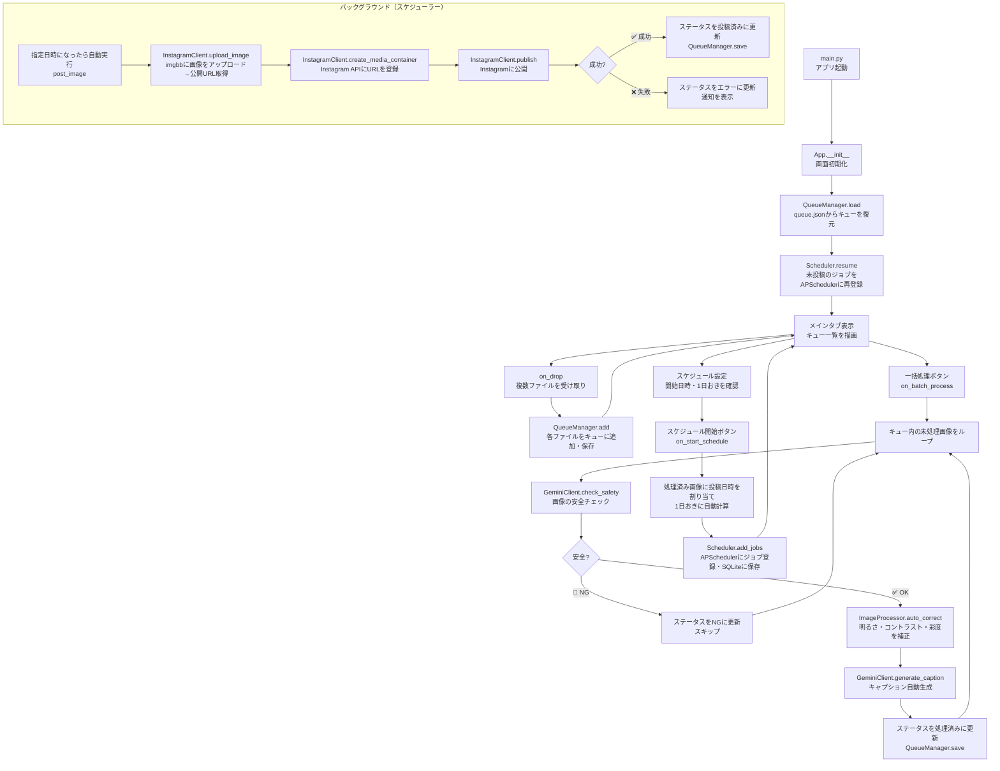

# アプリ動作フローチャート

```mermaid
flowchart TD
    A["main.py<br/>アプリ起動"] --> B["App.__init__<br/>画面初期化"]
    B --> B1["QueueManager.load<br/>queue.jsonからキューを復元"]
    B1 --> B2["Scheduler.resume<br/>未投稿のジョブをAPSchedulerに再登録"]
    B2 --> F["メインタブ表示<br/>キュー一覧を描画"]

    F --> G["on_drop<br/>複数ファイルを受け取り"]
    G --> G1["QueueManager.add<br/>各ファイルをキューに追加・保存"]
    G1 --> F

    F --> H["一括処理ボタン<br/>on_batch_process"]
    H --> H1["キュー内の未処理画像をループ"]

    H1 --> I["GeminiClient.check_safety<br/>画像の安全チェック"]
    I --> I1{"安全?"}
    I1 -- "🚫 NG" --> I2["ステータスをNGに更新<br/>スキップ"]
    I2 --> H1

    I1 -- "✅ OK" --> J["ImageProcessor.auto_correct<br/>明るさ・コントラスト・彩度を補正"]
    J --> K["GeminiClient.generate_caption<br/>キャプション自動生成"]
    K --> K1["ステータスを処理済みに更新<br/>QueueManager.save"]
    K1 --> H1

    F --> L["スケジュール設定<br/>開始日時・1日おきを確認"]
    L --> M["スケジュール開始ボタン<br/>on_start_schedule"]
    M --> M1["処理済み画像に投稿日時を割り当て<br/>1日おきに自動計算"]
    M1 --> M2["Scheduler.add_jobs<br/>APSchedulerにジョブ登録・SQLiteに保存"]
    M2 --> F

    subgraph BG["バックグラウンド（スケジューラー）"]
        N["指定日時になったら自動実行<br/>post_image"] --> O["InstagramClient.upload_image<br/>imgbbに画像をアップロード→公開URL取得"]
        O --> P["InstagramClient.create_media_container<br/>Instagram APIにURLを登録"]
        P --> Q["InstagramClient.publish<br/>Instagramに公開"]
        Q --> R{"成功?"}
        R -- "✅ 成功" --> S["ステータスを投稿済みに更新<br/>QueueManager.save"]
        R -- "❌ 失敗" --> T["ステータスをエラーに更新<br/>通知を表示"]
    end
```
